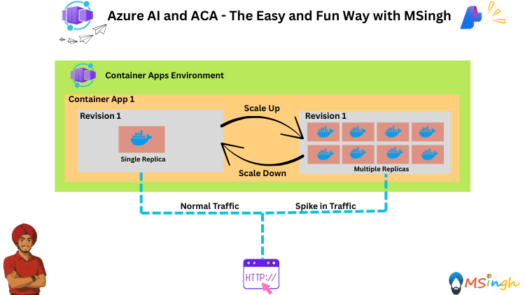
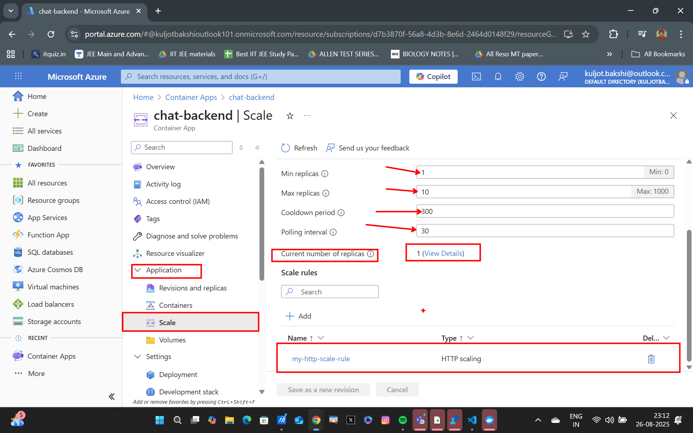

## Event Driven HTTP Scaling in Azure Container Apps (ACA)



### Lab Overview

In this lab, you will learn how to implement event-driven HTTP scaling in Azure Container Apps. You will explore how to automatically scale your containerized applications based on HTTP traffic and other events, ensuring optimal performance and resource utilization.

### Setting Export Variables

Lets quickly set some export variables for script usage in the lab.
```bash
export ACR_NAME="YOUR_ACR_NAME"
export RG_NAME="YOUR_RESOURCE_GROUP_NAME"
export ACA_ENV_NAME="YOUR_ACA_ENV_NAME"
```

### Adding out HTTP Sclaing Rule

We will now add an HTTP Scaling rule. The rule will state that if the HTTP traffic to the `ChatBackend` application exceeds a certain concurrency threshold of `1` requests at a time, the application should scale up to handle the increased load with the `min-replicas` set to `1` and `max-replicas` set to `10`.
```bash
az containerapp update \
    --name chat-backend \
    --resource-group $RG_NAME \
    --min-replicas 1 \
    --max-replicas 10 \
    --scale-rule-name my-http-scale-rule \
    --scale-rule-http-concurrency 1
```

The way the HTTP Scaler works is:
```
Desired replicas = (current concurrent requests ÷ http_concurrency target)
```

Example:
- 25 concurrent requests
- Target concurrency = 1
- Desired replicas = 25
- ACA then clamps this number between your --min-replicas (1) and --max-replicas (10).

So in this case, it would only go up to 10 replicas, even if more requests are coming in.



### View Scaling in Azure Portal

Let's now ramp up our HTTP traffic and observe the scaling behavior.

```bash
seq 1 100 | xargs -I{} -P20 curl -s -X POST https://<ACA-FQDN>/chat \
  -H "Content-Type: application/json" \
  -d '{"message":"tell me something about France"}'
```

You can see the total number of replicas running in the Azure Portal.


---


### Observability and Metrics

You can also go to the `Metrics` section under the `Monitoring` tab in the Azure Portal to get a view of all the events that are/were happening in your container app.


---

---

---


### Summary
In this lab, you learned how to set up HTTP-based scaling for your Azure Container Apps using KEDA. You observed how the system scales in response to incoming HTTP requests and how to monitor these scaling events through logs and the Azure Portal. Additionally, you explored optional CPU and memory scaling configurations to further optimize your application's performance.