## Azure Container Apps (ACA) with Azure Key Vault (AKV) Secret Storage

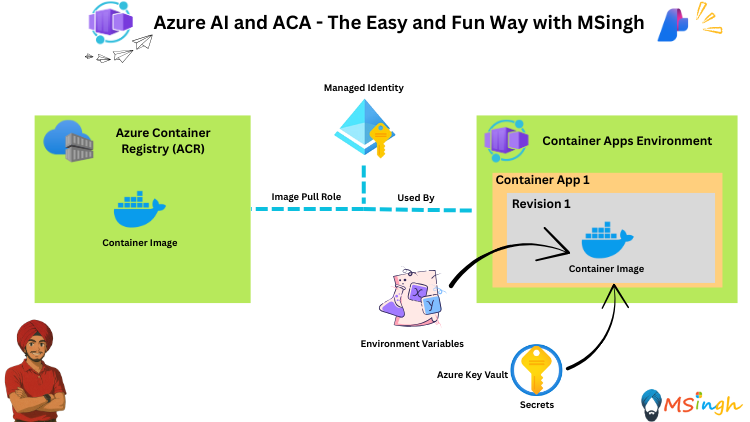

### Creating Azure Key Vault and Storing Secrets
Create an Azure Key Vault to store your secrets securely. Then create a User-Assigned Managed Identity (UAMI) and grant it access to the Key Vault with the `key vault secrets user` role.

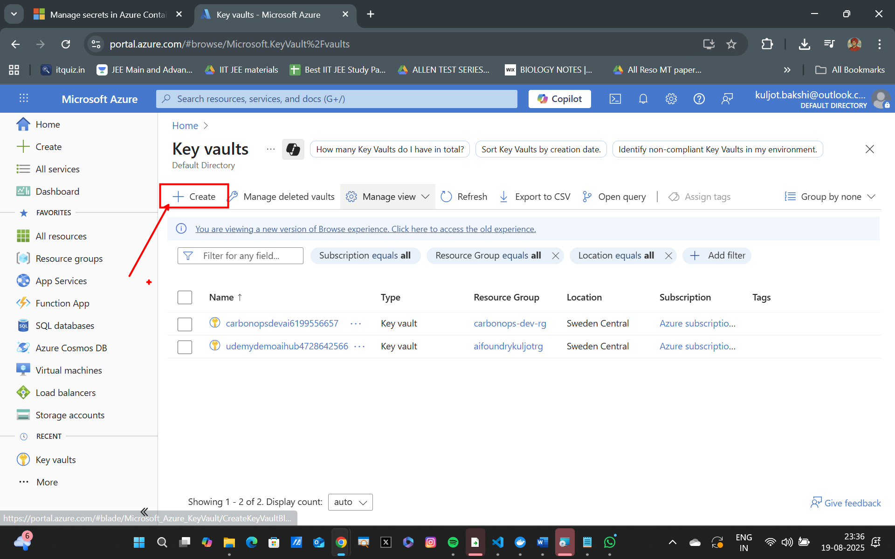
---
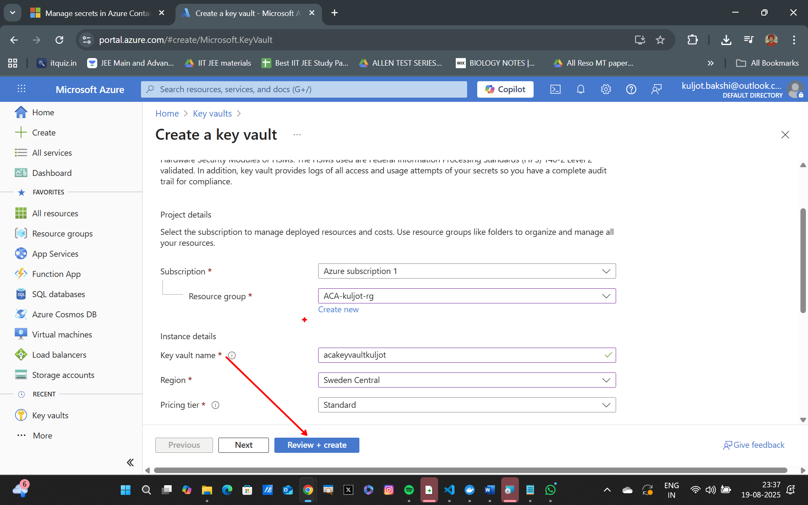
---
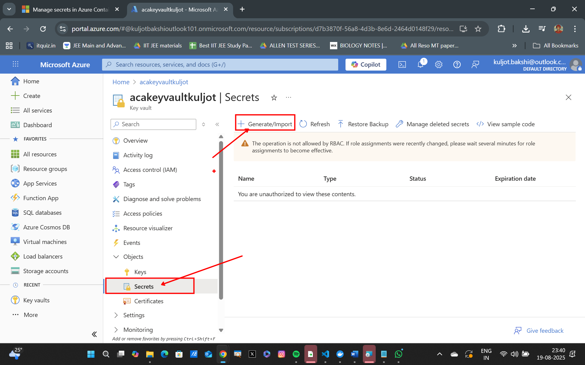
---
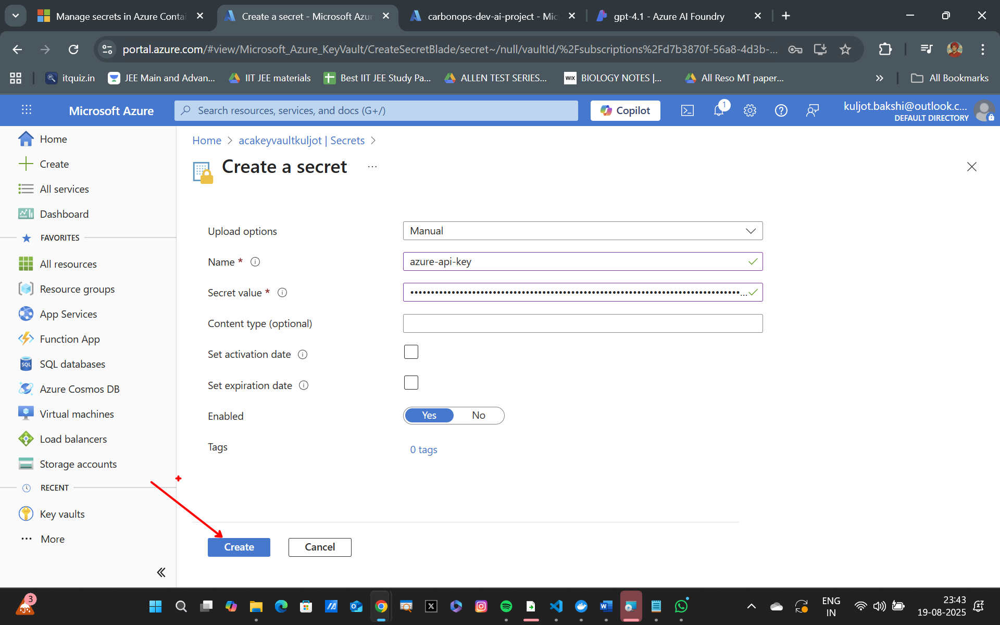
---
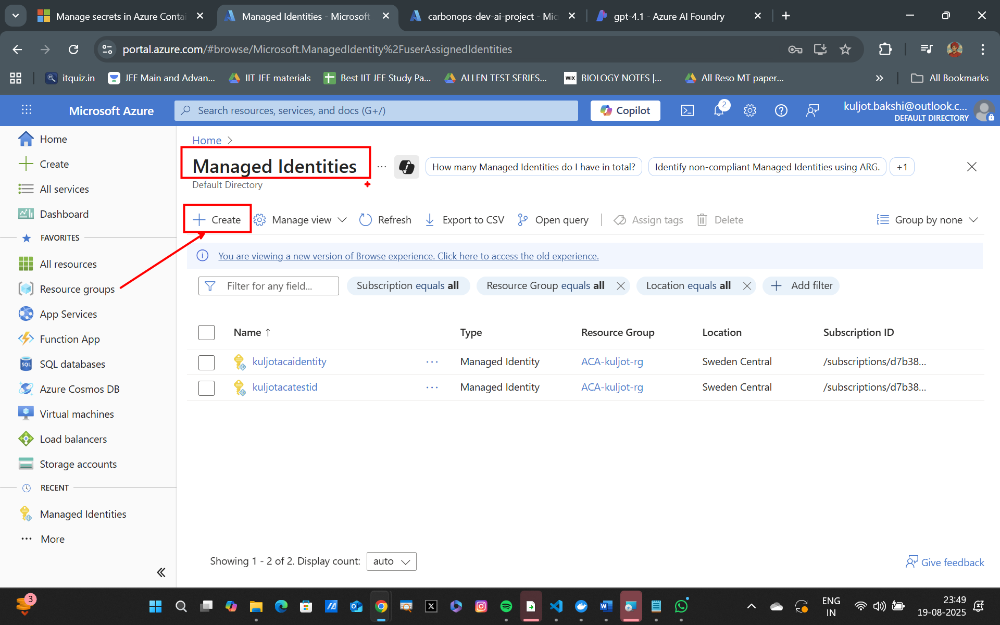
---
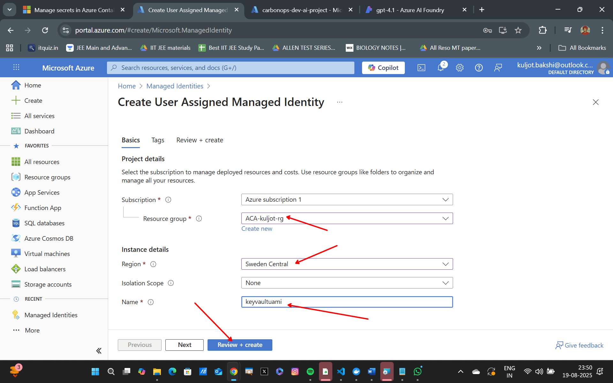
---
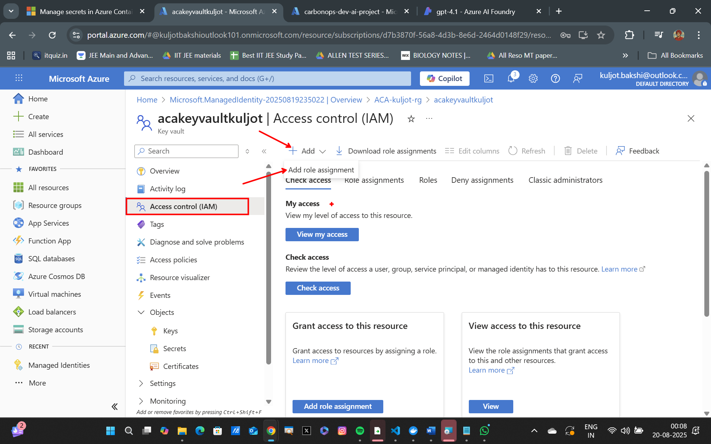
---
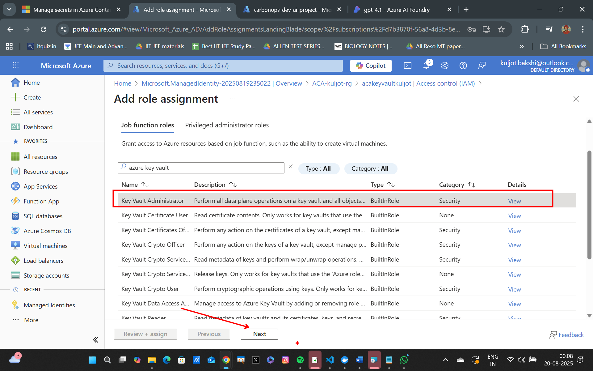
---
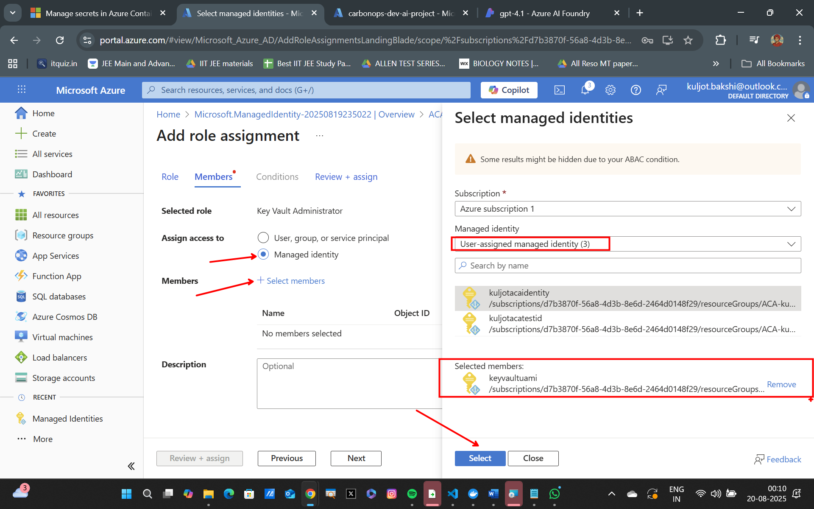
---
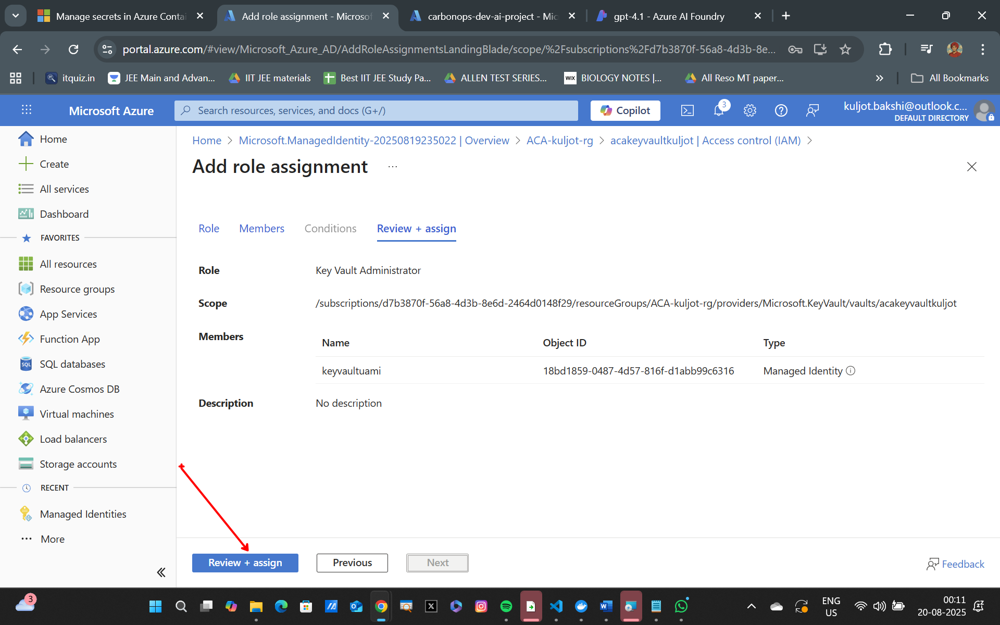
---

### Deploying the ChatBackend Application to Azure Container Apps
Run the following command to deploy the application:
```bash
## login to azure CLI
az login

# Set Variables
export KEY_VAULT_SECRET_URI="<YOUR_KEY_VAULT_SECRET_URI>"
export UAMI_NAME="YOUR_UAMI_NAME"
export UAMI_IDENTITY_ID="YOUR_UAMI_IDENTITY_ID"

## Deploy Application to Container App
az containerapp create \
  -g $RG_NAME -n chatbackendapp-akv \
  --image $ACR_NAME.azurecr.io/chatbackend:latest \
  --environment $ACA_ENV_NAME \
  --target-port 5000 \
  --ingress external \
  --registry-server $ACR_NAME.azurecr.io \
  --user-assigned $UAMI_NAME \
  --registry-identity system \
  --secrets azure-api-key=keyvaultref:$KEY_VAULT_SECRET_URI,identityref:$UAMI_IDENTITY_ID \
  --env-vars azure-api-url=$AZURE_API_URL azure-model-name=$AZURE_MODEL_NAME azure-api-key=secretref:azure-api-key
```

Run the following command to test your deployment:
```bash
curl -X POST <YOUR_CONTAINER_APP_FQDN>/chat -H "Content-Type: application/json" -d "{\"message\":\"hi\"}"
```

### Summary
In this lab, we explored how to securely store and access secrets in Azure using Azure Key Vault (AKV) and User Assigned Managed Identity (UAMI). We built the ChatBackend application and configured it to use these secrets for its Azure API integration. By leveraging AKV and UAMI, we ensured that sensitive information, such as API keys, is not hard-coded into our application, but instead securely retrieved at runtime.