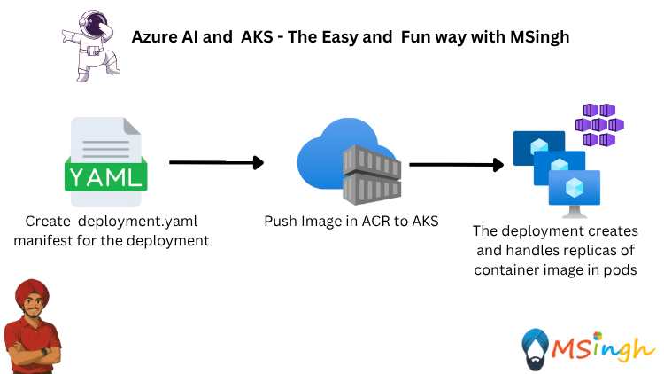

## Deploy an AI App from ACR to AKS



### Using Kubectl to create resource manifests

Going back to the azure-openai-chat application, we can create a Deployment resource to run the application in Kubernetes.

If you have never written a Kubernetes manifest file, you can use the Draft CLI to create a manifest file for you or use another common method which is to use the kubectl CLI to create a manifest file.

First lets set the environment variable for the Azure Container Registry (ACR) name.
```bash
export ACR_NAME="your-acr-name"
```

Create a directory called manifests in the root of the repository to store the manifest files.
```bash
mkdir manifests
```

Let's create a Deployment resource manifest for the azure openai chat application.
```bash
kubectl create deployment aoaichatapp \
--image=$ACR_NAME.azurecr.io/aoaichatapp:latest \
--port=80 \
--dry-run=client \
--output yaml > manifests/aoaichatapp-deployment.yaml
```

This command creates a Deployment resource named aoaichatapp using the image from the Azure Container Registry (ACR) and outputs the manifest in YAML format to a file named aoaichatapp-deployment.yaml in the manifests directory.

### Creating resources with Kubectl

Deploying a manifest file is as simple as running the following command:
```bash
kubectl apply -f manifests/aoaichatapp-deployment.yaml
```

To view the status of the Deployment resource, you can run the following command.
```bash
kubectl get deployment aoaichatapp
```

Once you see that the contoso-air Pod is running, you can stop the watch command by pressing Ctrl+C in the terminal.

To view the application in your browser, you can run a port-forward command to forward the port from the Pod to your local machine.
```bash
kubectl port-forward deployment/aoaichatapp 8080:80
```

> **ℹ️ Note:**  
> By default, Kubernetes resources are only accessible from within the cluster. To access a resource from outside the cluster, you need to create a Service resource to expose it. We'll cover that later.  
>  
> In the meantime, you can use the `kubectl port-forward` command to forward a port from your local machine to the Pod. This allows you to access the application as if it were running locally.

You can now access the application in your browser at http://localhost:8080/.

To stop the port-forward command, you can press Ctrl+C in the terminal.