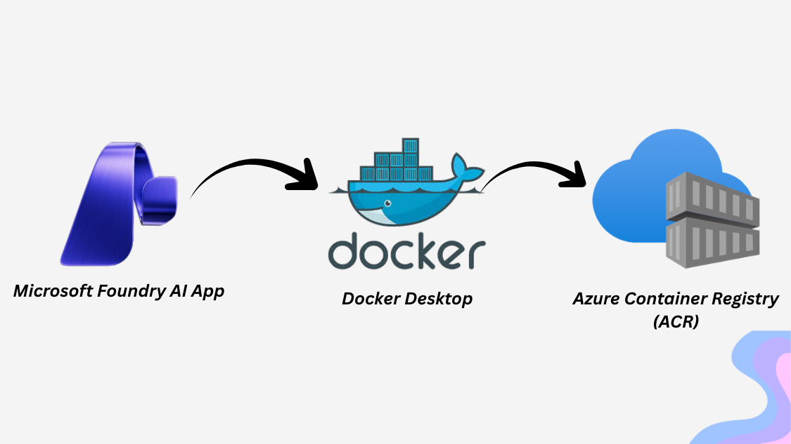

### Run An AI Application Locally with Docker and Push to ACR



In this section, you will learn how to run an AI application locally using Docker. This is a crucial step before deploying your application to the cloud, as it allows you to test and debug your application in a local environment. Then you will learn how to push your Docker image to Azure Container Registry (ACR) so that it can be easily deployed to Azure services like Azure Kubernetes Service (AKS) or Azure App Service.

#### Build the Image Locally with Docker

To build the Docker image locally, navigate to the directory containing your Dockerfile and run the following command:

```bash
docker build . -t aoaipythonapp
```

#### Run the Image Locally with Docker
Once the image is built, you can run it locally using the following command:

```bash
docker run -p 5000:5000 aoaipythonapp
```

#### Throw an HTTP POST Request to the Application Running Locally
With the application running locally, you can send an HTTP request to test it. You can use tools like `curl` or Postman to send a request to `http://localhost:5000/`. For example, using `curl`:

```bash
curl -X POST http://localhost:5000/chat -H "Content-Type: application/json" -d "{\"message\":\"Can you please suggest some places to travel in India?\"}"
```

#### Push the Image to Azure Container Registry (ACR)
To push your Docker image to Azure Container Registry (ACR), run the following commands:
```bash
# Set the ACR name variable for reuse
export ACR_NAME=<your-acr-name>

az acr login --name $ACR_NAME
docker tag aoaipythonapp $ACR_NAME.azurecr.io/aoaipythonapp:v1
docker push $ACR_NAME.azurecr.io/aoaipythonapp:v1
```